# HR Reporting — User Guide

> **Who this is for:** A new HR administrator using HR Reporting for the first
> time.
> **What this covers:** The day-to-day tasks you'll perform — signing in,
> finding people, running and exporting reports, pinning positions, and the
> admin tasks of configuring reports and posting announcements.
> **What this does not cover:** The underlying design, data model, or SQL
> internals. This is a *how-to* document, not a design document.
>
> The guide uses the **local test environment** and signs in with the admin
> test account (see [Chapter 1](#chapter-1--getting-started)). All the screens
> and data you see are synthetic fixture records — no real employee personal
> information is shown.

---

## Table of Contents

1. [Getting Started](#chapter-1--getting-started)
2. [Locating & Viewing People](#chapter-2--locating--viewing-people)
3. [Running & Exporting Reports](#chapter-3--running--exporting-reports)
4. [Position Details & Pins](#chapter-4--position-details--pins)
5. [Report Configuration (Admin)](#chapter-5--report-configuration-admin)
6. [Announcements & System Messages](#chapter-6--announcements--system-messages)
7. [Personal Preferences](#chapter-7--personal-preferences)

---

## Chapter 1 — Getting Started

### 1.1 Sign in

**Goal:** Access the application with your administrator credentials.

1. Open the app in your browser: `http://localhost:5173`.
2. In the **Wake ID** field, enter your Wake ID.
3. In the **Employee ID** field, enter your employee number.
4. **Optional:** Check **Stay signed in on this device** to skip the sign-in
   form on your next visit.
5. Click **Sign in**.

**Expected result:** You land on the **Home** page (or whichever page you saved
as your default home — see [Chapter 7](#chapter-7--personal-preferences)). The
topbar on the right shows *“Welcome, &lt;first name&gt; — &lt;position&gt;,
&lt;school&gt;”*.

For this guide, sign in with the admin test account: **Wake ID `hr.admin`**,
**Employee ID `900003`**. This account has the `hr_admin` role, so it can see
the **Report Configuration** navigation entry and the admin section of the
Settings drawer.

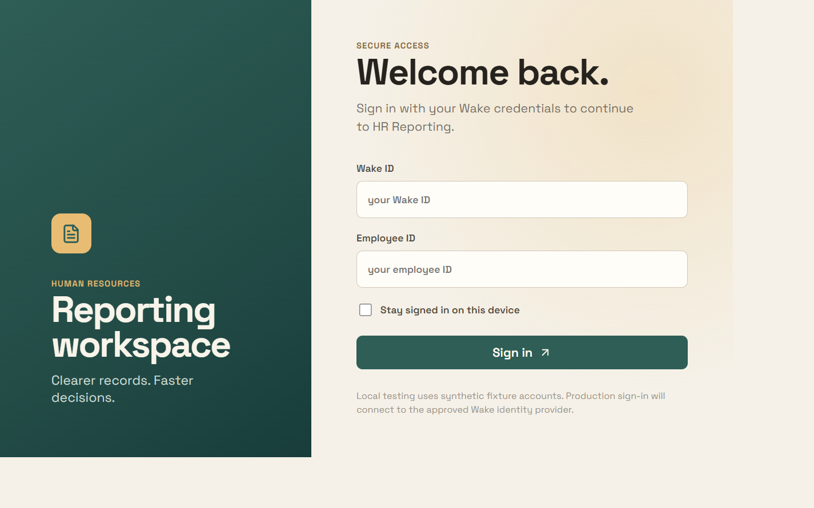

> 💡 If you previously checked **Stay signed in**, the app signs you in
> automatically and skips this form. Click **Sign out** (top-right) to clear it.

> 💡 Local testing uses synthetic fixture accounts. In production you'll sign in
> through the approved Wake identity provider instead.

### 1.2 Understand the layout

**Goal:** Recognize the main regions of the app so you can navigate confidently.

1. **Sidebar (left):** The main navigation.
   - **Home** — the people directory.
   - **Reports** — the report catalog.
   - **Positions** — your pinned positions (a badge shows the count).
   - **Report Configuration** — admin settings (visible only to admins).
2. **Topbar (right):** Your welcome block, the **Settings** gear, the
   **dark/light theme** toggle, and **Sign out**.
3. **Announcement banners:** If an admin has posted an active banner, a strip
   appears just under the topbar. Click the **✕** on the banner to dismiss it.

**Expected result:** You can switch between Home, Reports, and Positions from
the sidebar and reach your personal and admin settings from the topbar gear.

---

## Chapter 2 — Locating & Viewing People

### 2.1 Search the directory

**Goal:** Find a person by name, employee number, or organization.

1. Go to **Home**.
2. In the **People lookup** box, type a name, employee number, or organization.
3. **Optional:** Use the **Filter by school** dropdown to narrow to one school
   or department.
4. Click **Search** (or press **Enter**).

**Expected result:** A results table appears with **Person**, **Organization**,
**Position**, and **Employee no.** columns. The **recently searched** counter
on the left tracks the people you've opened.

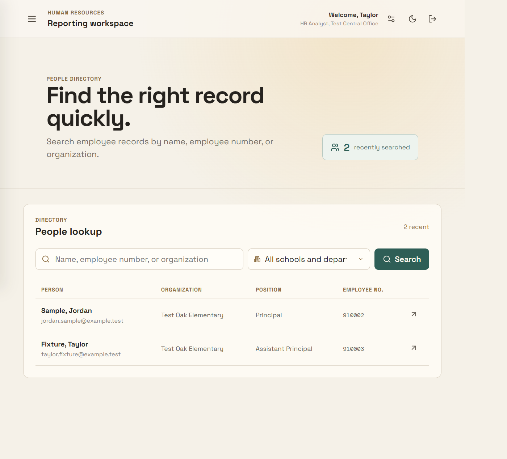

### 2.2 Open a full employee record

**Goal:** View the complete employee report for a person.

1. Click a row in the search results (or click the person's name).
2. The **Employee record** drawer opens on the right.

**Expected result:** The drawer shows the employee's name, an **Active** status,
and the record laid out as cards. Eight sections are available — **Identity**,
**Contact**, **Assignment**, **Compensation**, **Contract**, **Licensure**,
**Service summary**, and **Leave balances**. Each card's header has controls to
hide, move, recolor, and reorder it.

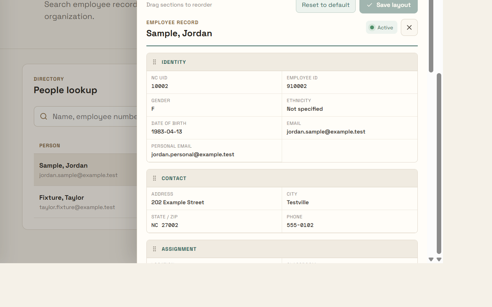

### 2.3 Customize the employee record layout

**Goal:** Reorder, hide/show, and recolor the record sections to suit how you
work.

1. Open an employee record (see [2.2](#22-open-a-full-employee-record)).
2. Drag the **⋮⋮** handle on a section header to reorder the visible cards.
3. Click the **eye** icon on a header to hide a section (it collapses into a
   hidden row with a **Show section** button).
4. Click the **palette** icon to change a section's header color.
5. Use the **⬆ / ⬇** buttons to move a section up or down.
6. Click **Save layout** to persist your changes, or **Reset to default** /
   **Show all sections** to restore the default arrangement.

**Expected result:** Your layout is saved for your user account and reappears
the next time you open an employee record.

### 2.4 Toggle monthly / yearly salary

**Goal:** Switch the proposed salary display between monthly and yearly
figures.

1. In the **Compensation** section, find the **Proposed salary** field.
2. Click it.

**Expected result:** The value toggles between the monthly figure and the
yearly figure (yearly = monthly × 12).

---

## Chapter 3 — Running & Exporting Reports

### 3.1 Open the report catalog

**Goal:** Browse the available HR reports.

1. Click **Reports** in the sidebar.

**Expected result:** The **Report center** opens with the heading
“Choose a report.” Reports are grouped into **sections** (for example,
**Person**, **Certification and evaluation**, **Staffing and contracts**), each
with an options count. The top shows a **school picker** and a **Filter
reports** box, plus a **Recently run** strip.

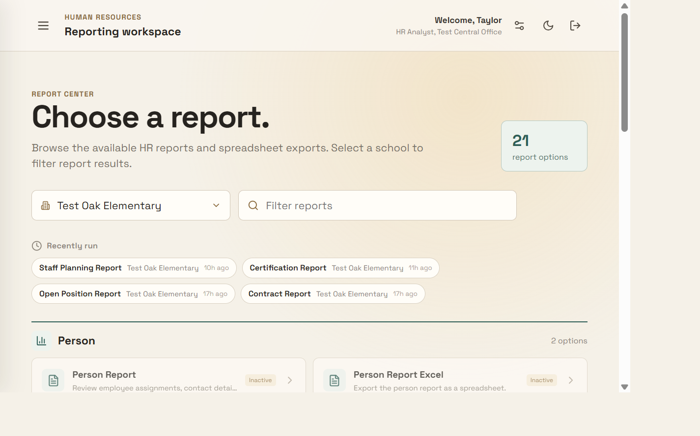

### 3.2 Pick a school

**Goal:** Scope report output to one school or department.

1. Click the **school combobox** at the top of the Reports page.
2. Select a school or department (for example, **Test Oak Elementary**).

**Expected result:** The school is remembered for you and used as the scope
for reports you run.

### 3.3 Run a report

**Goal:** View report rows.

1. Click a report option (for example, **Staff Planning Report**).
2. A results table loads for the selected school.

**Expected result:** A data table appears with an **Export to Excel**, **Export
to CSV**, and **Export to PDF** button in the toolbar, a **Filter rows** box, a
**Columns** chooser, a row count (“X of Y rows”), and sortable column headers.

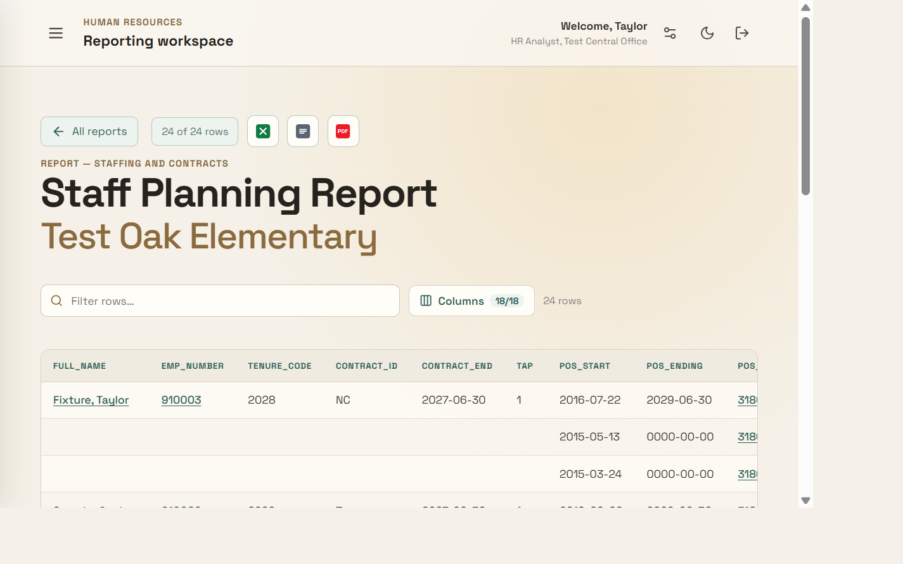

> 🔒 Reports marked **Inactive** in Report Configuration are greyed out with an
> “Inactive” badge and cannot be opened (see [Chapter 5](#chapter-5--report-configuration-admin)).

### 3.4 Filter, sort, and manage columns

**Goal:** Manipulate the result grid.

1. **Filter rows:** Type in the **Filter rows** box to match across the visible
   columns.
2. **Sort:** Click a column header to toggle ascending → descending → none.
3. **Columns:** Click **Columns** → check or uncheck to show/hide, or move
   **⬆ / ⬇** to reorder the visible columns.

**Expected result:** The displayed rows and the column count update
immediately. Any active row filter is also applied to exports.

### 3.5 Filter by a highlight rule

**Goal:** Narrow rows to those matching an admin-configured highlight rule.

1. If any highlight rules are configured for the report, click a **highlight
   chip** to filter to the matching rows; click the chip again to clear the
   filter.

**Expected result:** Only the matching rows remain, tinted with the rule's
color (rules are configured in [Chapter 5](#chapter-5--report-configuration-admin)).

### 3.6 Export to Excel / CSV / PDF

**Goal:** Download the current grid.

1. Use the **Excel**, **CSV**, or **PDF** button in the report toolbar.

**Expected result:** A file downloads named
`<report-title>-<school>.xlsx` / `.csv` / `.pdf`.

- **Excel** honors row-highlight fills; if the report has a subreport it
  appears as a second **Subreport** sheet; any **Additional columns** are
  appended at the end.
- **CSV** is UTF-8; a subreport is appended after a blank spacer row.
- **PDF** uses a styled header and footer, orients landscape when there are
  more than 5 columns, and adds page footers.

### 3.7 Re-open a recent run

**Goal:** Quickly reload a report you ran earlier.

1. On the Reports catalog, click a chip under **Recently run**.

**Expected result:** The report reopens with the same school selected.

---

## Chapter 4 — Position Details & Pins

### 4.1 Open position details

**Goal:** Inspect a position.

1. Click a position link — either a **position number** in a report cell or a
   position number on the **Positions** page.

**Expected result:** A read-only **Position details** drawer opens with the
**General** tab (position number, account, organization, dates, administrator,
region, and more) and a **Notes** tab, plus an **Incumbent** section with
**Current** and **Future** tabs.

### 4.2 Pin / unpin a position

**Goal:** Keep a position on the **Positions** page for quick access.

1. In the **Position details** drawer, click the **pin** icon (top-right).

**Expected result:** The icon becomes filled and the position appears on the
**Positions** page. The sidebar **Positions** badge updates to the new count.

### 4.3 Manage pinned positions

**Goal:** Find, open, or remove pinned positions.

1. Click **Positions** in the sidebar.
2. Search by position number, title, or incumbent, or filter by organization.
3. Click a position number to reopen its details; click the **🗑** icon to
   remove it from your pinned list.

**Expected result:** The pinned list updates and the count badge refreshes.

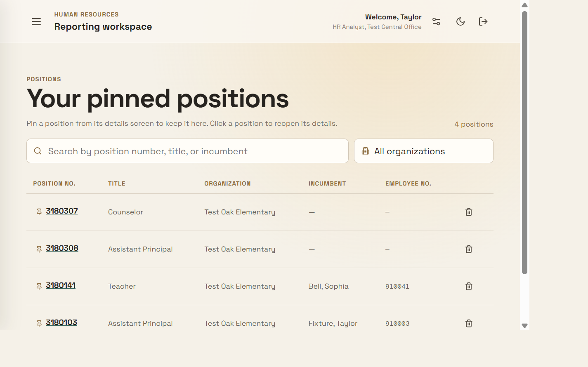

### 4.4 Add a note to a position

**Goal:** Attach a comment to a position for collaborators.

1. Open the **Position details** drawer (see [4.1](#41-open-position-details)).
2. Click the **Notes** tab.
3. Type your note and submit it.

**Expected result:** The note appears and a badge count shows on the Notes tab.

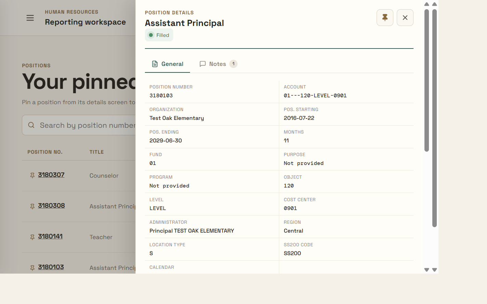

---

## Chapter 5 — Report Configuration (Admin)

> **Only admins can do this.** The Report Configuration navigation entry is
> visible only to users with the `hr_admin` role. Sign in as the admin account
> (`hr.admin` / `900003`) to access it.

### 5.1 Organize report sections

**Goal:** Group reports into catalog sections.

1. Open **Report Configuration** in the sidebar.
2. Click the **Sections** tab.
3. Enter a **New section title** and click **Add section**.
4. **Rename** or **Archive** an existing section as needed.

**Expected result:** Sections appear on the Reports catalog. Archived sections
are hidden until reactivated.

### 5.2 Author a report

**Goal:** Create an admin-authored report backed by SQL.

1. Open **Report Configuration** → **Reports** tab → **New report**.
2. Fill in the **General** tab:
   - **Title** and an optional **Description**.
   - **Section** — the catalog group this report belongs to.
   - **Status** — keep it **Inactive** until you've validated it.
   - **SQL query** — a single, read-only `SELECT` (or `WITH`) statement that
     must reference the `:organization` bind parameter.
   - **Display columns** — a comma-separated list (optional; leave blank to use
     the query's columns).
3. Click **Validate**. On success a **Valid** badge appears; errors show
   inline (for example, a forbidden keyword, a multi-statement query, or a
   missing `:organization`).
4. Click **Preview** to run against a chosen school and see the first rows
   (with any rule tinting applied).
5. Set **Status** to **Active**, then click **Save report**.

**Expected result:** The report appears in the catalog as active and can be
run by users.

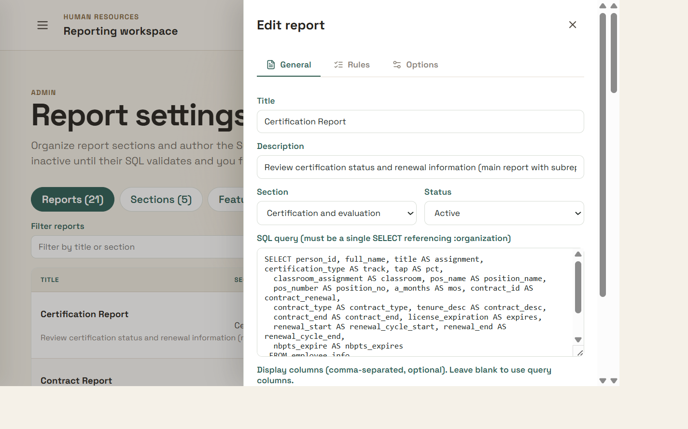

### 5.3 Build row-highlighting rules

**Goal:** Tint matching rows automatically so important rows stand out.

1. In the report editor, open the **Rules** tab.
2. Click **Add rule** and choose **Match any (OR)** or **Match all (AND)**.
3. Add conditions (**WHEN** column operator value). Operators include
   `equals`, `not equals`, `contains`, `does not contain`, `is empty`, and
   `is not empty`. You can use `THISYEAR` / `NEXTYEAR` for the current or next
   year.
4. Choose a **color** from the pastel palette.
5. Drag the **⋮⋮** handle to set rule priority (**first match wins**). Up to
   10 rules are allowed, with up to 5 conditions each.
6. **Save report.** Rules apply to the on-screen rows and are carried into
   Excel and PDF exports.

### 5.4 Configure export options

**Goal:** Add blank output columns and/or a subreport.

1. In the report editor, open the **Options** tab.
2. **Additional Columns** — enter comma-delimited names to append to the end
   of the Excel export.
3. **Subreport** — a read-only child `SELECT` that must reference
   `:person_id`. Set a **Subreport key column** (defaults to `person_id`).
   Leave the SQL blank to disable. Nested rows appear in the preview, in the
   Excel **Subreport** sheet, and in the PDF block.
4. **Save report.**

### 5.5 Activate / archive a report

**Goal:** Control whether a report is visible and runnable.

1. In the **Reports** tab, click **Edit** on a report and set **Status** to
   **Active**.
2. Or click **Archive** to set it to **Inactive** and hide it from the catalog.

**Expected result:** Active reports open; inactive reports are greyed out with
an “Inactive” badge.

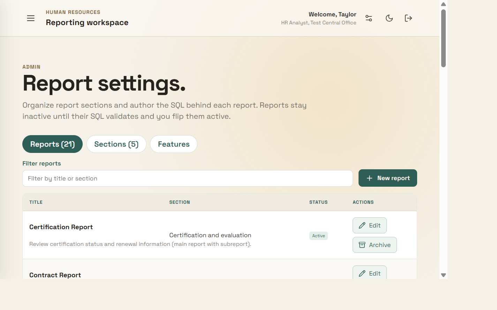

---

## Chapter 6 — Announcements & System Messages

> **Only admins can do this.** Announcements are managed under the **Settings
> gear**, not the Report Configuration page.

### 6.1 Create a banner

**Goal:** Show a slim, dismissible announcement strip.

1. Click the **gear** icon in the topbar → the **Settings** drawer opens.
2. Under **System-wide messages**, set the type to **Banner**.
3. Enter an optional **Title**, a **Message**, and check **Active**.
4. Click **Add message**.

**Expected result:** A banner appears on every page and users can dismiss it.
Up to 3 active banners can be shown at once.

### 6.2 Create a splash

**Goal:** Show a full-screen, one-time announcement at sign-in.

1. Set the type to **Splash**, add a **Title** and **Message**, set
   **Active**, and click **Add message**.

**Expected result:** On the next sign-in, a full-screen overlay appears once;
clicking **Got it** dismisses it.

### 6.3 Edit / activate / delete a message

**Goal:** Manage existing announcements.

1. Use the **✎** icon to edit, the **● / ◌** icon to toggle active/inactive,
   and the **🗑** icon to delete.

**Expected result:** The message list reflects your changes. Active banners
re-surface after an edit even if they were previously dismissed.

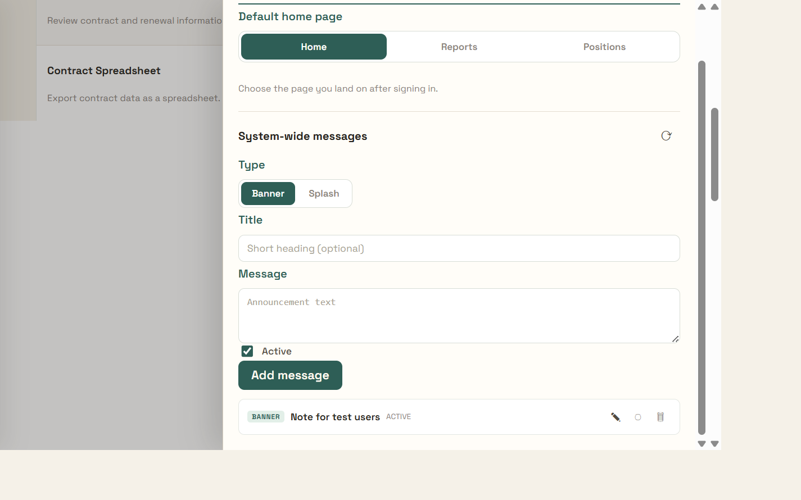

---

## Chapter 7 — Personal Preferences

### 7.1 Set the default landing page

**Goal:** Choose where you land after signing in.

1. Click the **gear** icon in the topbar → the **Settings** drawer opens.
2. Under **Default home page**, choose **Home**, **Reports**, or **Positions**.

**Expected result:** Your next sign-in lands on the page you selected. This is
saved per user.

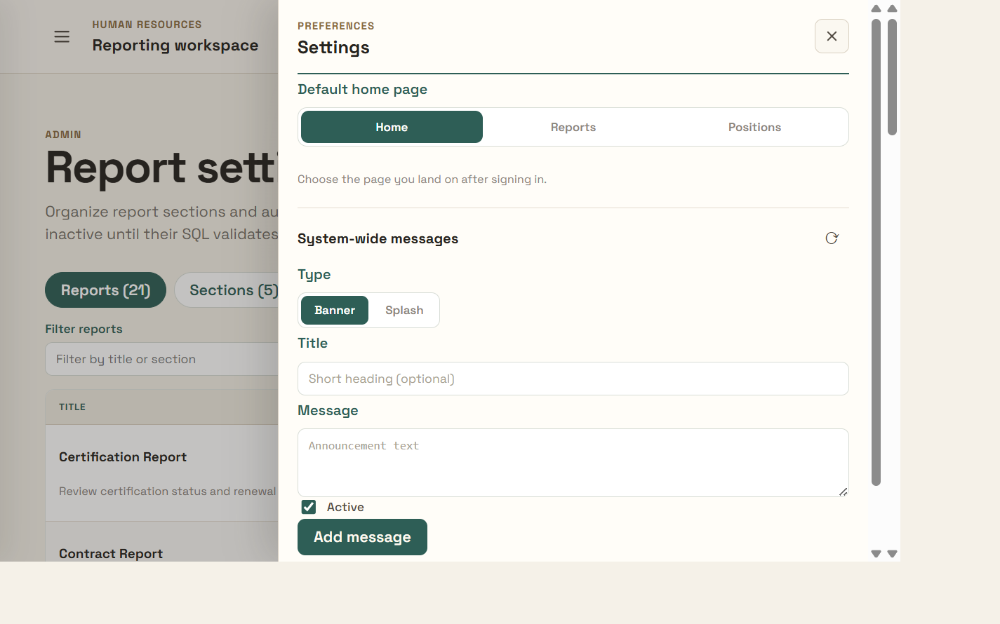

### 7.2 Toggle dark mode

**Goal:** Switch the app between the light and dark theme.

1. Click the **moon / sun** icon in the topbar.

**Expected result:** The whole app re-themes and your choice persists across
sessions.

---

## Appendix — Local test accounts

The local environment ships with synthetic fixture accounts you can use to see
role-based differences. The main guide uses the admin account.

| Role | Wake ID | Employee ID | What you can see |
|------|---------|-------------|------------------|
| `hr_admin` | `hr.admin` | `900003` | Full admin — sees **Report Configuration** and the admin settings |
| `school_staff` | `school.staff` | `900001` | Standard staff — no admin navigation |
| `principal` | `principal.one` | `900002` | Restricted school access |

> ⚠️ Never capture real employee personal data (SSN, date of birth, contact
> details, salary, license numbers) in screenshots. The data shown in this
> guide is purely synthetic fixture data.
